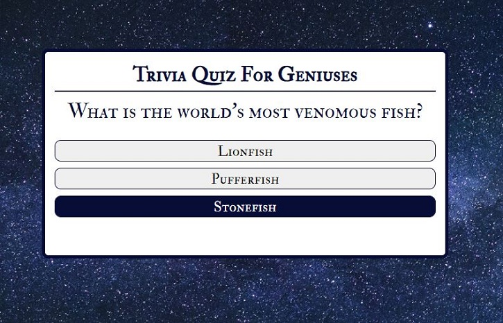
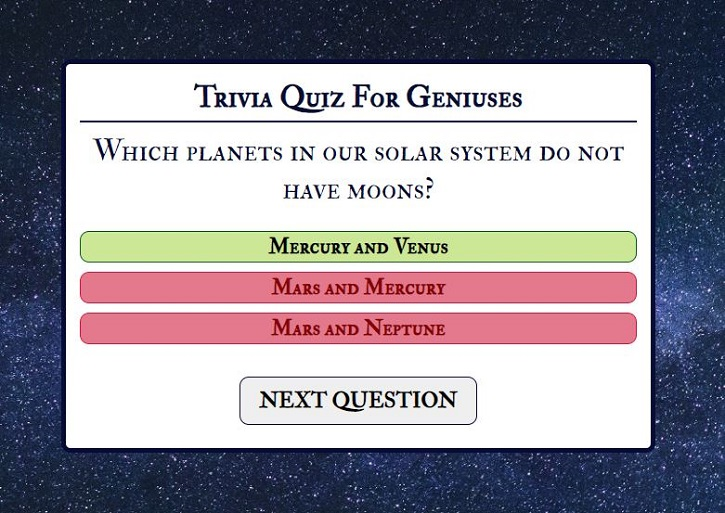
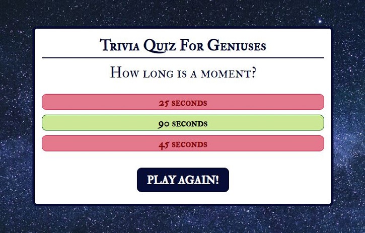
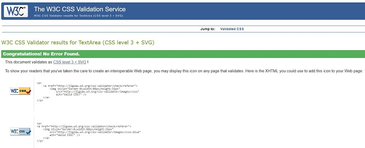
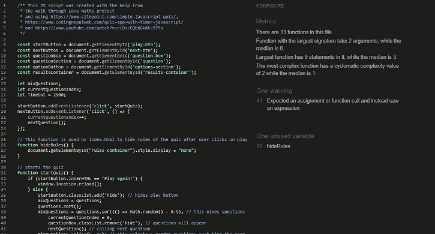

# **GENIUS TRIVIA QUIZ**

You can see the live site [here](https://amartins87.github.io/genius-trivia-quiz/).

The purpose of Genius Trivia Quiz is to test user's general knowledge through a variety of advanced questions. THe quiz is suitable for all those who would like to learn new nteresting facts. 

*Please press **Ctrl** in Windows or **Command** on Mac button and click for any links which you would like to open in a new tab when in the README.md file*

## **FEATURES**

- ### **START GAME PAGE IMAGE**
    - The main page has a box with rules of the game and a play button which will turn dark blue with text to bold white when you hover over it.

- ### **FOOTER**
    - Contains copyright information, including a year of creation and my name.

- ### **QUIZ PAGE - START**

    - Shows questions with three possible options on display
    - Next Questions button is not visible before you select your answer

- ### **QUIZ PAGE - HOVER**
    - When a user hovers over the options, the buttons will change their background color to a shade of dark blue color and the text will become bold white. 

- ### **QUIZ PAGE - CORRECT/INCORRECT OPTION**
    - When an answer is selected, the background of the buttons will turn light green/light red according to being correct/incorrect.
    - User can see which answer he selected as the font will change to italic and border will increase to 5px.
    - Next Question button will appear and again it will turn dark blue with text to bold white when you hover over it.

- ### **QUIZ PAGE - END SCREEN**
    - The screen shows the text 'Finished!' and 'Play Again' button which will turn dark blue with text to bold white when you hover over it.

## **FUTURE DEVELOPMENT**

I would like to add pop-up modals with interesting facts about the correct answers. I would also like to add a question counter and a timer. 

## **TESTING**

Here are my [Balsamiq wireframes](assets/wireframes/Balsamiq_wireframe.JPG). 

I kept the styling of the quiz to a minimum to make it accessible and easy to navigate through on every device without the need for media queries. I set a simple background image with a backup background color of black for a good contrast in case the image doesn't load up.

I tested the uiz in Chrome Developer Tools using responsive design as well as all of the available device types listed. 

I tested the quiz on an iPad and iPhone 8, in Chrome and Microsoft Edge on my desktop PC with a screen resolution of 1920px by 1080px. I also tested the quiz on a laptop in Chrome, Mozilla, and Microsoft Edge. The site is responsive, looks good, content is readable on all standard screen sizes and I found it easy to click on all buttons after the padding got increased.

### **VALIDATOR TESTING**

-   **HTML** (No errors were returned when passing through the official W3C validator) 
    

-   **CSS** (No errors were found when passing through the official Jigsaw validator)
    
    

-   **JSHINT** (17 warnings and 1 unused variable found)
    
    

### **ACCESSIBILITY**

I checked that the chosen colors and fonts are easy to read. The page has passed through  the Lighthouse reporting tool in Chrome developer tools on both mobile and desktop.
- [Contrast checker - body and header text](assets/wireframes/accessibility/Body_text_contrast_checker.JPG)
- [Contrast checker - correct class](assets/wireframes/accessibility/Correct_class_contrast_checker.JPG)
- [Contrast checker - incorrect class](assets/wireframes/accessibility/Incorrect_class_contrast_checker.JPG)
- [Contrast checker - active class and hover selector](assets/wireframes/accessibility/Hover_selector_contrast_checker.JPG)

***
- [Lighthouse report - mobile](assets/wireframes/accessibility/Lighthouse_mobile_report.JPG)

***
- [Lighthouse report - desktop](assets/wireframes/accessibility/Lighthouse_desktop_report.JPG)

## **BUGS**

-   

## **UNFIXED BUGS**

-   

## **DEPLOYMENT**

The site was deployed to GitHub pages. The steps to deploy are as follows:
1.  In the GitHub repository, navigate to the **Settings** tab, then **Pages** section
2.  From the **Source** section drop-down menu, select the **Branch:main**
3.  Once the master branch has been selected, the page will be automatically refreshed with a detailed ribbon display to indicate the successful deployment.
4.  Now this site is live and published on https://amartins87.github.io/genius-trivia-quiz/.

## **CREDITS**

- **CONTENT**
    - My source for questions and correct answers was [Best Life](https://bestlifeonline.com/genius-trivia-questions/).

    - The icons in the rules container and at the end of the game were taken from [Font Awesome](https://fontawesome.com/)

- **CODE**
   

- **MEDIA**

    - Background image was sourced from Pexels and it belongs to [Felix Mittermeier](https://www.pexels.com/photo/galaxy-1146134/).
