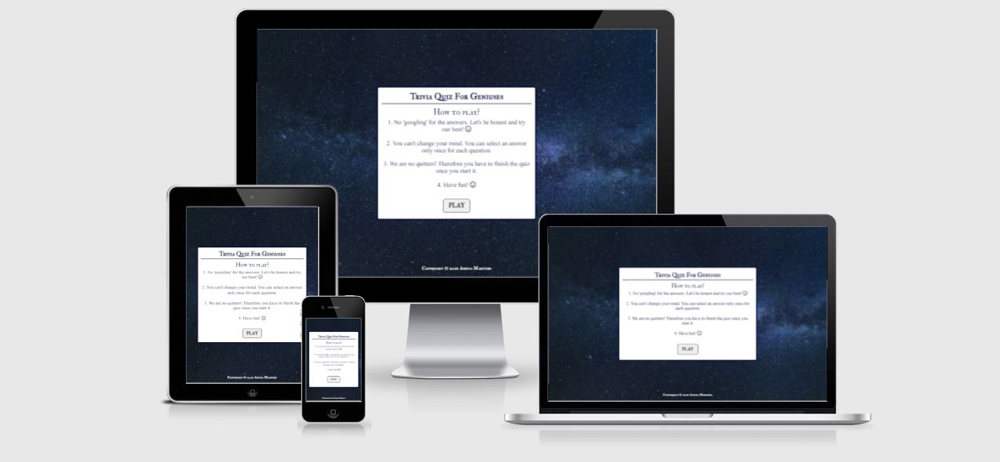
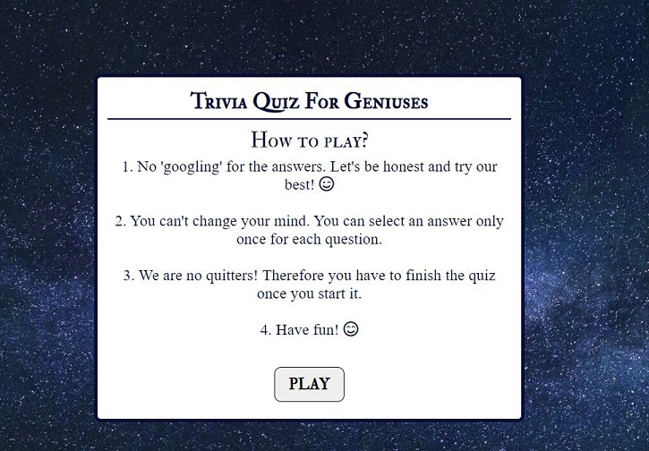
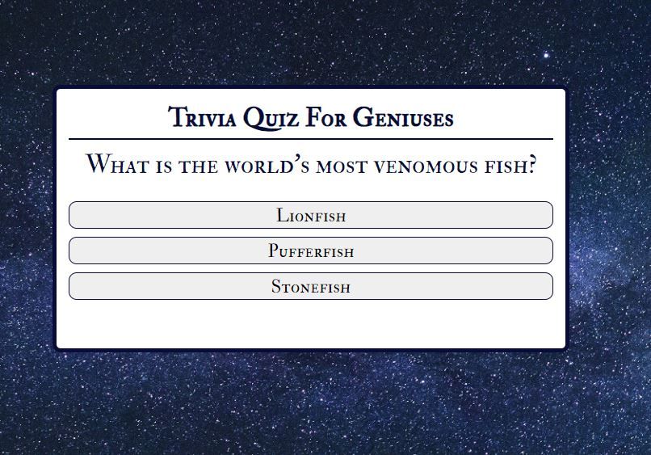
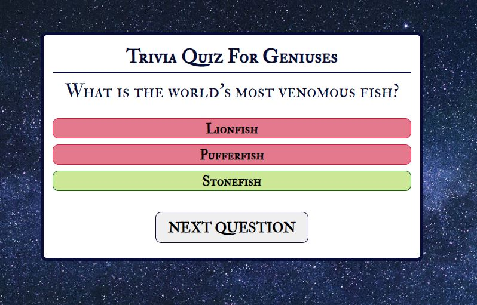
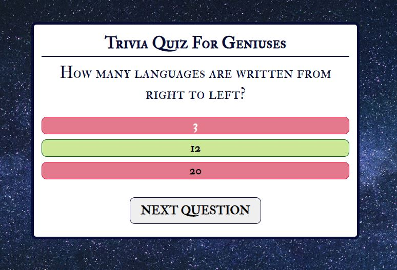
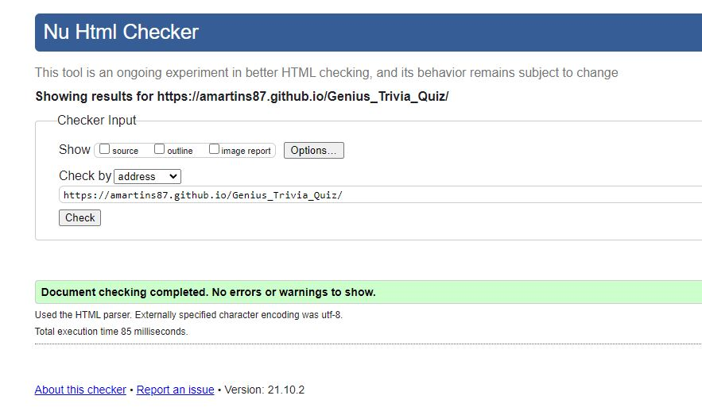
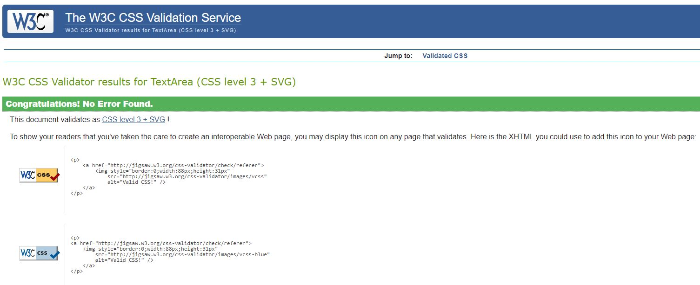

# **GENIUS TRIVIA QUIZ**

You can see the live site [here](https://amartins87.github.io/Genius_Trivia_Quiz/).

The purpose of Genius Trivia Quiz is to test user's general knowledge through a variety of questions. 

I kept the site simple containing only a background image with a back up background color of black in case the image doesn't load up for a good contrast. 

*Please press **Ctrl** in Windows or **Command** on Mac button and click for any links which you would like to open in a new tab when in the README.md file*

## **FEATURES**

- ### **START GAME PAGE IMAGE**
    - The main page a box with rules of game and a play button. 

- ### **FOOTER**
    - Contains copyright information, including a year of creation and my name.

- ### **QUIZ PAGE**
    - 

## **FUTURE DEVELOPMENT**

I would like to add pop up modals with interesting facts about the correct answers. Also I would like to add a question counter and a timer. 

## **TESTING**

As you can see in my [wireframes](assets/wireframes/Makaton_wireframe_all.png), the layout was originally planned slightly differently, including the position and display of a navbar. 

I kept the styling of the game to a minimum to make it accessible and easy to navigate through on every device. 

I tested every page in Chrome Developer Tools using responsive design as well as all of the available device types listed. 

I tested every page on iPad and iPhone 8, and I asked my friends and family to test the site on their mobile devices (Huawei, Xiaomi Redmi, and Samsung). They confirmed the quiz functioned well on their devices.

I tested the website in Chrome and Microsoft Edge on my desktop PC with widescreen (screen resolution of 1920px by 1080px), and tested it on a laptop in Chrome, Mozilla, and Microsoft Edge. The site is responsive, looks good, content is readable on all standard screen sizes and I found it easy to click on all buttons. 

### **VALIDATOR TESTING**

-   **HTML** (No errors were returned when passing through the official W3C validator 
    

-   **CSS** (No errors were found when passing through the official Jigsaw validator
    
    

### **ACCESSIBILITY**

I checked that the chosen colors and fonts are easy to read. All pages have passed through  the Lighthouse reporting tool in Chrome developer tools on both mobile and desktop.
- [Contrast checker - body and header text](assets/wireframes/accessibility/Body_text_contrast_checker.JPG)
- [Contrast checker - correct class](assets/wireframes/accessibility/Correct_class_contrast_checker.JPG)
- [Contrast checker - incorrect class](assets/wireframes/accessibility/Incorrect_class_contrast_checker.JPG)
- [Contrast checker - active class and hover selector](assets/wireframes/accessibility/Hover_selector_contrast_checker.JPG)

***
- [Lighthouse report - mobile](assets/wireframes/accessibility/Lighthouse_mobile_report.JPG)

***
- [Lighthouse report - desktop](assets/wireframes/accessibility/Lighthouse_desktop_report.JPG)

## **BUGS**

-   

## **UNFIXED BUGS**

-   

## **DEPLOYMENT**

The site was deployed to GitHub pages. The steps to deploy are as follows:
1.  In the GitHub repository, navigate to the **Settings** tab, then **Pages** section
2.  From the **Source** section drop-down menu, select the **Branch:main**
3.  Once the master branch has been selected, the page will be automatically refreshed with a detailed ribbon display to indicate the successful deployment.
4.  Now this site is live and published on https://amartins87.github.io/Genius_Trivia_Quiz/.

## **CREDITS**

- **CONTENT**
    - My source for questions and correct answers was [Best Life](https://bestlifeonline.com/genius-trivia-questions/).

    - The icons in the footer and a sign up form were taken from [Font Awesome](https://fontawesome.com/)

- **CODE**
   

- **MEDIA**

    - Background image was sourced from Pexels and it belongs to [Felix Mittermeier](https://www.pexels.com/photo/galaxy-1146134/).
